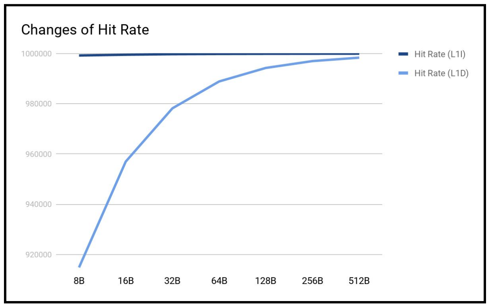

# The_gem5_Simulator

In this repository, I use the gem5 program to simulate L1 block size in a hardware simulator and measure its effect on L1 cache hit rate for the matrix multiplication benchmark in Google Colab. The average L1 hit rate is defined as the ratio of the memory operations which hit in L1 cache. 

You can see mainly 3 files:

  - Report.pdf (You can examine the results.)
  - gem5_hw.docx (You can see the homework file.)
  - Org_Project_GEM5.ipynb (You can see the jupyter notebook that I runned on Google Colab.)

### Main Results of Homework

